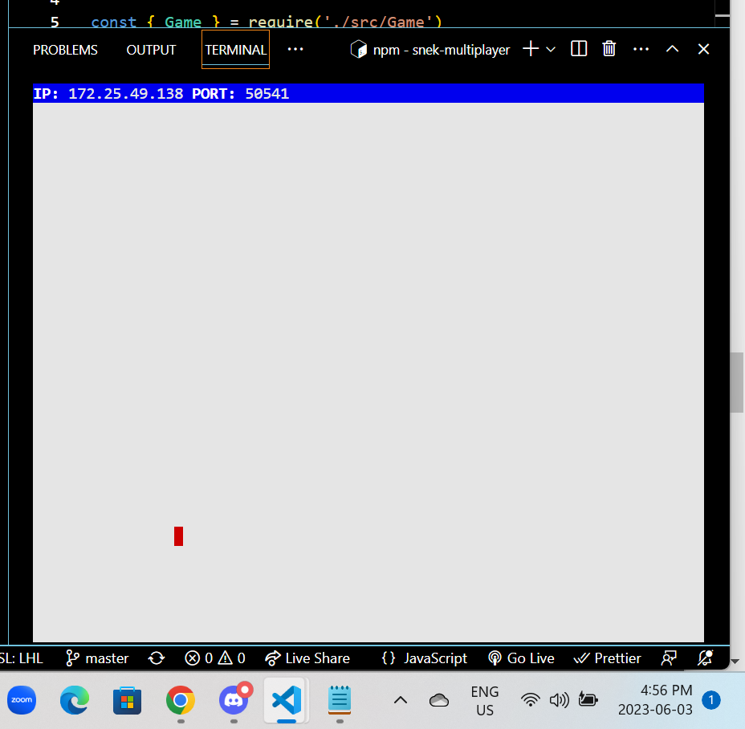
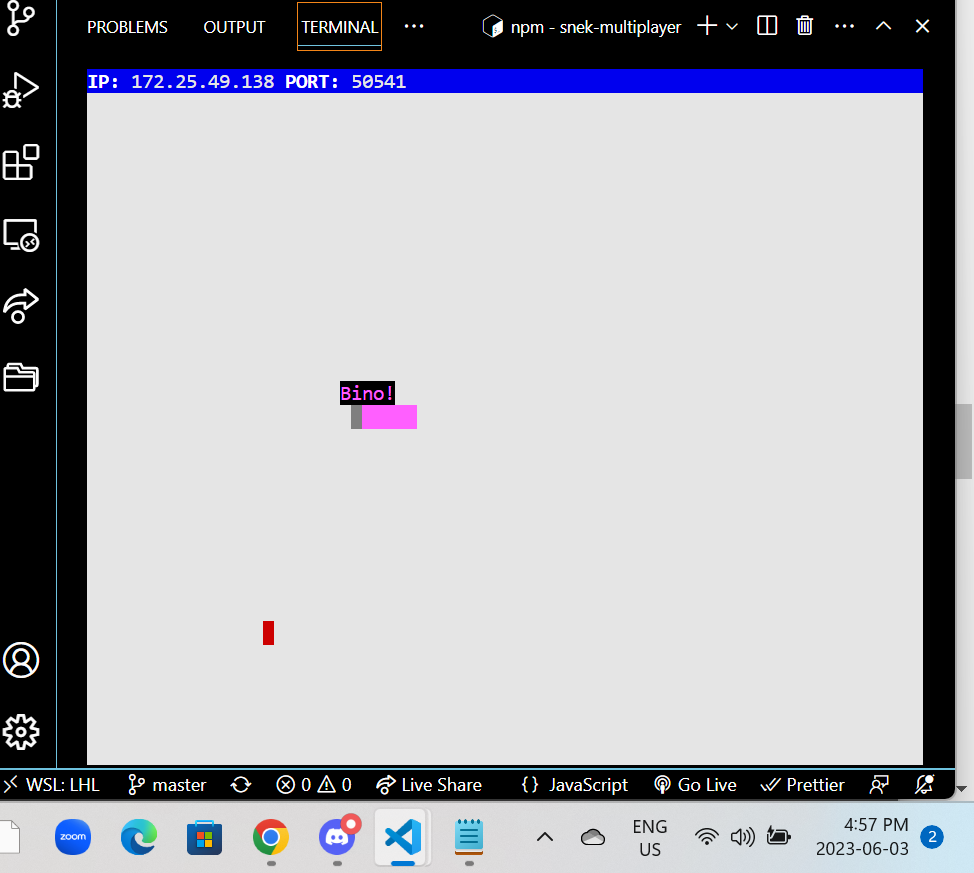

# snake-client
Snake game is a very popular video game. It is a video game concept where the player maneuvers a dot and grows it by ‘eating’ pieces of food. As it moves and eats, it grows and the growing snake becomes an obstacle to smooth maneuvers. The goal is to grow it to become as big as possible without bumping into the side walls, or bumping into itself, upon which it dies.
## Prerequisites
This is simply a multiplayer take on the genre.
Prerequisites
Before you can run this client, you will need to be running the server side which you can download and install from here. 
(https://github.com/lighthouse-labs/snek-multiplayer)

### Final Product

## Getting Started
-Clone the repository: git clone https://github.com/calgarybino/snake-client.git
-Change to the project directory: cd snake-client
-Install dependencies  npm install
- Run the development snake client using the `node play.js` command.
-To terminate the snake client use Ctrl + C from keyboard.
-The keys W, a, s, and d keys are mapped with the strings to be up, left, down and right movement keys.
